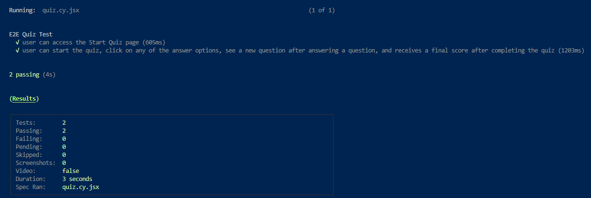

# Tech Quiz Test Suite

## Description

This is a UMN Coding Module Challenge. The goal was to implement Cypress component and end-to-end testing for a Tech Quiz application. 

## Table of Contents

- [Installation](#installation)
- [Usage](#usage)
- [Questions](#questions)
- [Links](#links)

## Installation

Create a new folder in your local system.

Open the folder in VS Code.

In the Terminal, type `git init` to set up a local Git repository in the selected folder.

Clone the repository locally with  `git clone git@github.com:sketchyTK/Tech-Quiz-Test-Suite.git` (if using SSH).

You will need VS Code and MongoDB/Compass installed locally. 

Once you have cloned the repository locally, you will need to type `npm install` in the Terminal of VS Code. 

Then type `npm run install` to install dependencies for the client and server.

After that, type `npm run client:build`, `npm run build` and `npm run seed`

## Usage

To run the component test type `npm run component-test` in the command line, or type `npm run cypress` to test using the Cypress GUI.

To run the End-to-End test you will need to have the server and client running. In your terminal type `npm run start:dev`

Then open a new terminal window (leave the server running and the old terminal open) . In the new window run `npm run test` for a terminal based test or run `npm run cypress` to test using the Cypress GUI.

## Questions

Here is a link to my Github Profile: <a href="https://github.com/sketchyTK">Sketchy TK</a>

## Links

<a href="https://github.com/sketchyTK/Tech-Quiz-Test-Suite">GitHub repository</a>

<a href="https://drive.google.com/file/d/13vTimt5gNqn6OmHhl4b8Wp0hNfX2Pzze/view">Walkthrough Video</a>